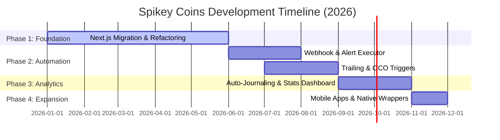

# Spikey Coins - Project Roadmap

This document outlines the product vision, major phases, and upcoming milestones for Spikey Coins.

---

## 🗺️ Product Vision
Spikey Coins aims to be the ultimate, high-performance unified trading terminal for retail and algorithmic traders. By consolidating multiple traditional and crypto brokerages (Zerodha Kite, Upstox, Binance Futures) into a single, real-time, resilient interface, Spikey Coins reduces context-switching and provides advanced execution capabilities (such as automated SL/TP matching, algo order support, and simulation environments) normally reserved for institutional trading desks.

---

## 🚀 Phase Timeline

---

## 📌 Milestones

### Phase 1: Foundation & Refactoring (Current/Completed) ✅
Focus on architecture cleanup, Next.js migration for frontend performance, and API stability.
*   **Next.js App Router Migration:** Port entire React-Vite UI into Next.js.
*   **Robust Connection Resilience:** Implement infinite WebSocket reconnection with exponential backoff for price streams.
*   **Centralized Broker Architecture:** Abstract broker clients into a unified `BrokerFactory` wrapper.
*   **Reliable Polling & Retry Mechanics:** Build automatic retries for broker data pipelines (e.g., funds API, positions sync).
*   **Algo Order Integration:** Add initial algorithmic order support into SL/TP tracking operations.

### Phase 2: Smart Execution & Automation (Next Up) ⏳
Enhance the trading terminal with advanced order execution models and automation triggers.
*   **Trailing Stop-Loss & OCO Orders:** Add client-side and server-side tracking for trailing stops and One-Cancels-the-Other (OCO) order logic.
*   **Webhook Alert Executor:** Build a public HTTP webhook listener that parses incoming TradingView or custom alert payloads to execute pre-configured trades instantly.
*   **Chart Drawing Tools:** Integrate drawing utilities (Trend lines, Fibonacci retracements, Support/Resistance zones) directly onto the TradingView Lightweight Charts.
*   **Advanced Binance Futures Configurations:** Support Single-Asset / Multi-Asset margins and Hedge Mode trading.

### Phase 3: Analytics, Journaling & Trading Gym 📈
Provide traders with actionable analytics and diagnostic tools to evaluate performance.
*   **Automated Trade Journaling:** Log historical trades and order fills into MongoDB. Add tags, notes, and screenshot uploads to specific trades.
*   **Performance Analytics Dashboard:** Visualize trading metrics like Win Rate, Profit Factor, Sharpe Ratio, average holding times, and account equity curves.
*   **Expanded Trading Gym:** Improve the market replay simulator to load ticks faster, support options backtesting, and record simulation history.

### Phase 4: Mobile & Ecosystem Expansion 📱
Extend the platform to mobile platforms and add notification integrations.
*   **Native App Wrappers:** Wrap the Next.js frontend into desktop and mobile native apps using Tauri or Capacitor.
*   **Multi-Broker Options chains:** Implement interactive options chains for Indian brokers (Kite, Upstox).
*   **Real-time Alerts Ecosystem:** Support Discord, Telegram, and Slack webhook alerts for order execution, position liquidations, and trade fills.
*   **MFA & API Key Encryption Vault:** Move user credential encryption to a hardware-security-module (HSM) friendly architecture (using AWS KMS or Vault).
